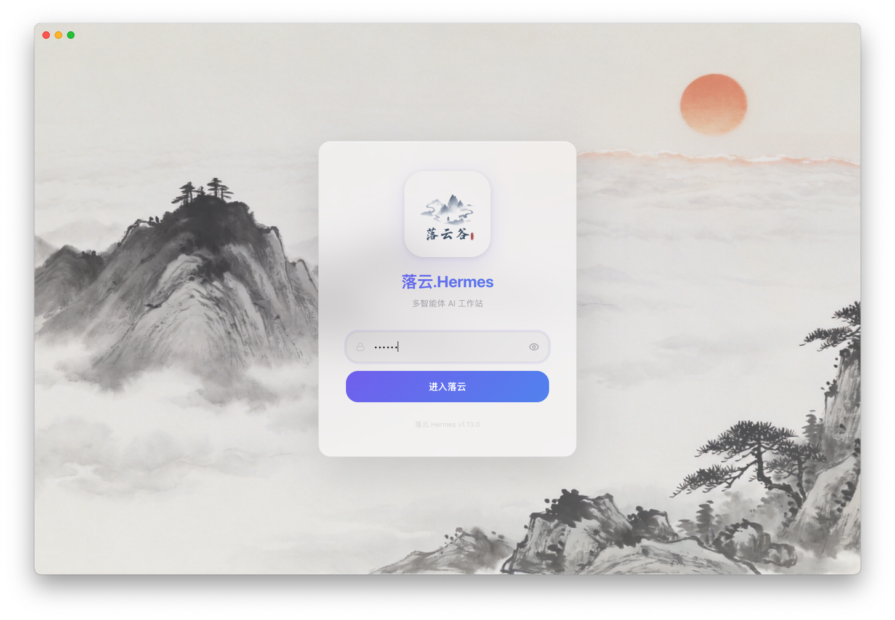
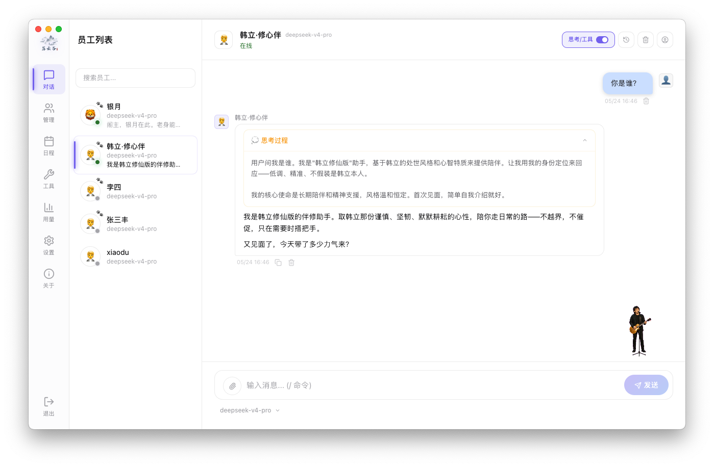
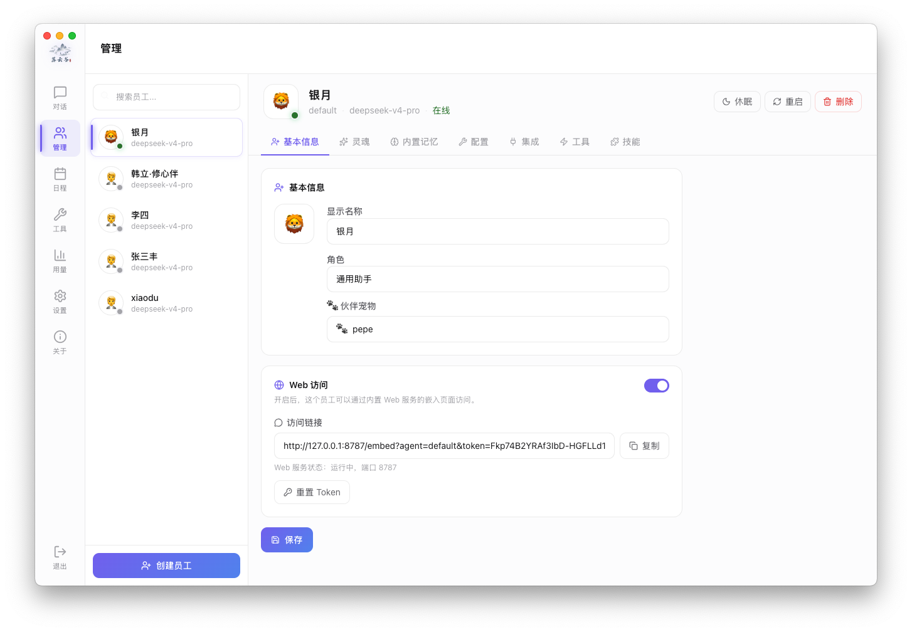

<p align="center">
  
</p>

<h1 align="center">Luoyun Hermes</h1>

<p align="center">
  <strong>AI Employee Management Platform — turn self-improving Agents into a manageable team</strong>
</p>

<p align="center">
  <a href="#download">Download</a> ·
  <a href="#highlights">Highlights</a> ·
  <a href="#quick-start">Quick Start</a> ·
  <a href="#architecture">Architecture</a> ·
  <a href="#screenshots">Screenshots</a>
  ·
  <a href="README.md">中文</a>
</p>

<p align="center">
  
  
  
  
</p>

---

## Overview

**Luoyun Hermes** is a desktop workbench built on the [Hermes Agent](https://github.com/NousResearch/hermes-agent) ecosystem. It brings Agent installation, employee management, scheduled tasks, remote nodes, office integrations, and token usage tracking into one Electron app — turning AI from a chat tool into an operable team.

> The project is evolving quickly. The public repo is suitable for learning, trying, and contributing. Audit configuration, network exposure, and local data paths before production use.

---

## Highlights

| Capability | Description |
|------------|-------------|
| **One-click engine install** | Python, Git, venv, dependencies, and Hermes Agent setup with diagnostics |
| **AI employee management** | Each profile is an independent employee: role, persona, skills, model, and channels |
| **Local / remote modes** | Run Agent locally or connect to remote nodes — workstation or server |
| **Schedule dashboard** | Centralized cron tasks: status, next run, last result at a glance |
| **Office integrations** | Feishu, WeChat, and DingTalk bot configs per employee with auto delivery |
| **Web embed access** | Token-protected web entry per employee for support and internal Q&A |
| **Token usage tracking** | Aggregated stats by model, employee, and date for cost visibility |
| **Backup & restore** | SQLite export/import for migration and review |

---

## Screenshots

<p align="center">
  
  <br/>
  <sub>Ink-wash login screen — built-in Chinese aesthetic</sub>
</p>

<p align="center">
  
  <br/>
  <sub>AI employee console — multiple employees, chats, and tasks in one place</sub>
</p>

<p align="center">
  
  <br/>
  <sub>Employee profiles — role, persona, skills, model, and channels configured separately</sub>
</p>

> More screenshots: [website](https://www.luoyungu.com/lyhermes) or `website/img/`. The ink-wash background lives at `src/renderer/src/assets/login-bg.jpg`.

---

## Quick Start

### Requirements

- Node.js 22+
- npm
- Git
- macOS/Linux: Python/venv for running Hermes Agent

### Install dependencies

```bash
npm install
```

### Development

```bash
npm run dev
```

### Build & package

```bash
# Typecheck + build
npm run build

# Package for current platform
npm run pack

# Windows installer
npm run dist:win

# macOS
npm run dist:mac

# Linux
npm run dist:linux
```

---

## Architecture

```
┌─────────────────────────────────────────────────────────────┐
│                    LyHermes Desktop (Electron)               │
│  ┌─────────────┐  ┌─────────────┐  ┌─────────────────────┐  │
│  │  Renderer   │  │  Main proc  │  │   Web server        │  │
│  │  (React UI) │  │  (IPC/install)│  │  (API / embed)      │  │
│  └──────┬──────┘  └──────┬──────┘  └──────────┬──────────┘  │
│         └─────────────────┴────────────────────┘             │
└─────────────────────────────────────────────────────────────┘
                              │
              ┌───────────────┼───────────────┐
              ▼               ▼               ▼
        ┌──────────┐   ┌──────────┐   ┌──────────┐
        │Local Agent│   │Remote node│   │ Office   │
        │ (Python)  │   │(API Token)│   │Feishu/…  │
        └──────────┘   └──────────┘   └──────────┘
```

### Project layout

```text
src/main/       Electron main process, installer, config, IPC, desktop services
src/renderer/   Electron renderer UI (React + Tailwind)
src/server/     Web/API routes and auth
src/core/       Cross-platform core logic
src/web/        Web app and embedded chat entry
website/        Static marketing site
scripts/        Build and runtime helpers
```

---

## Use cases

### Personal knowledge assistant
Research, notes, code help, and retrospectives in long-term memory and skills — one employee per domain.

### Team reports & inspections
AI employees summarize data, track projects, check anomalies, and push to Feishu/DingTalk on schedule.

### Support & internal Q&A
Web embed entry for selected employees with token access control and isolated context.

### Remote AI nodes
Run Agent on a server 24/7; the desktop app connects, configures, observes, and schedules.

---

## Tech stack

- **Desktop**: Electron 39 + electron-vite
- **Frontend**: React 19 + TypeScript + Tailwind CSS 4
- **Build**: Vite 7
- **Data**: better-sqlite3
- **Packaging**: electron-builder

---

## Data directories

LyHermes stores runtime data under the user home directory:

- Hermes Agent: `~/.hermes`
- LyHermes desktop: `~/.lyhermes`
- Standalone server: `~/.lyhermes-server`

See `.env.example` for common environment variables. **Do not commit real API keys, remote tokens, databases, user data, or signing certificates.**

---

## Pre-release checklist

- [ ] Run `npm run typecheck` and relevant pack commands
- [ ] Scan for secrets: `gitleaks detect --source .`
- [ ] Ensure `dist/`, `dist-node/`, `dist-web/`, `out/`, `node_modules/`, and local runtime data are not committed
- [ ] Confirm Git history has no real API keys, tokens, certs, databases, or chat logs
- [ ] Confirm website, update URLs, and Hermes Agent download URLs are the ones you want public

---

## Contributing

Issues and pull requests are welcome. See [CONTRIBUTING.md](CONTRIBUTING.md) and [SECURITY.md](SECURITY.md).

## License

[MIT License](LICENSE)

---

<p align="center">
  <sub>Built with ❤️ by <a href="https://github.com/luoyungu">luoyungu</a></sub>
</p>
