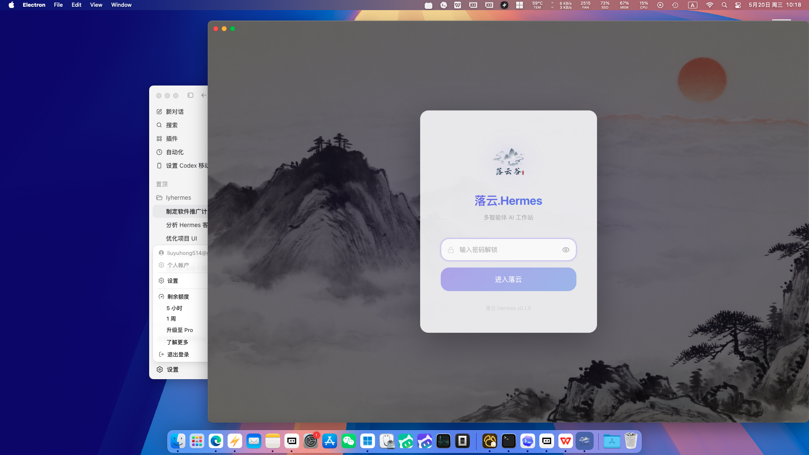
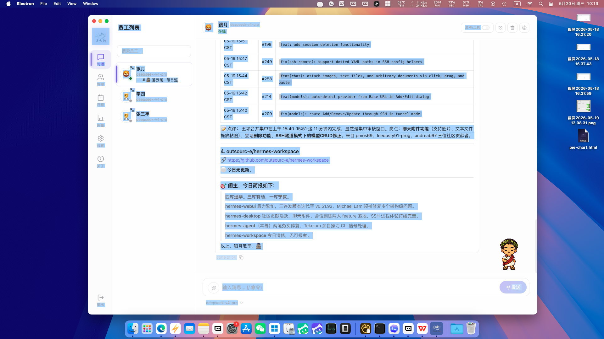

<p align="center">
  
</p>

<h1 align="center">落云.Hermes</h1>

<p align="center">
  <strong>AI 员工管理平台 —— 让自我成长的 Agent，成为一支可管理的团队</strong>
</p>

<p align="center">
  <a href="#下载体验">下载体验</a> ·
  <a href="#功能亮点">功能亮点</a> ·
  <a href="#快速开始">快速开始</a> ·
  <a href="#架构设计">架构设计</a> ·
  <a href="#截图预览">截图预览</a>
</p>

<p align="center">
  
  
  
  
</p>

---

## 一句话介绍

**落云.Hermes** 是基于 [Hermes Agent](https://github.com/NousResearch/hermes-agent) 生态构建的**中文桌面工作台**。它将 Agent 的安装、员工管理、定时任务、远程节点、办公协作和 Token 用量观测整合到一个 Electron 桌面应用中，让 AI 从"聊天工具"变成"可运营的团队"。

> 项目仍在快速迭代中。公开仓库中的代码适合学习、试用和共同改进；生产使用前请先审计配置、网络暴露面和本地数据目录。

---

## 功能亮点

| 能力 | 说明 |
|------|------|
| **一键安装引擎** | 自动完成 Python、Git、虚拟环境、依赖和 Hermes Agent 的安装与诊断 |
| **AI 员工管理** | 每个 profile 都是独立员工：角色、人格、技能、模型、渠道分开配置 |
| **本机 / 远程双模式** | 本地运行 Agent 或连接远程节点，适合个人工作站和服务器部署 |
| **定时任务看板** | cron 任务集中管理：启停状态、下次运行、上次结果一目了然 |
| **办公协作入口** | 飞书、微信、钉钉机器人配置归属到员工，结果自动投递 |
| **Web 嵌入访问** | 为指定员工生成带 Token 的 Web 入口，用于客服和内部问答 |
| **Token 用量观测** | 按模型、员工、日期聚合统计，成本可追溯 |
| **数据备份/恢复** | SQLite 数据库支持导出导入，方便迁移和复盘 |

---

## 截图预览

<p align="center">
  
  <br/>
  <sub>水墨风登录页 —— 项目内置的中国风视觉设计</sub>
</p>

<p align="center">
  
  <br/>
  <sub>AI 员工控制台 —— 多员工、多对话、多任务统一管理</sub>
</p>

> **提示**：项目截图中的水墨风背景图位于 `src/renderer/src/assets/login-bg.jpg`，由项目内置，开箱即用。

---

## 快速开始

### 环境要求

- Node.js 22+
- npm
- Git
- macOS/Linux 需要可用的 Python/venv 环境以运行 Hermes Agent

### 安装依赖

```bash
npm install
```

### 开发运行

```bash
npm run dev
```

### 构建打包

```bash
# 类型检查 + 构建
npm run build

# 打包当前平台
npm run pack

# 打包 Windows 安装包
npm run dist:win

# 打包 macOS
npm run dist:mac

# 打包 Linux
npm run dist:linux
```

---

## 架构设计

```
┌─────────────────────────────────────────────────────────────┐
│                    LyHermes 桌面端 (Electron)                  │
│  ┌─────────────┐  ┌─────────────┐  ┌─────────────────────┐  │
│  │  渲染进程    │  │   主进程     │  │     Web 服务端       │  │
│  │  (React UI) │  │  (IPC/安装)  │  │   (API/嵌入页面)     │  │
│  └──────┬──────┘  └──────┬──────┘  └──────────┬──────────┘  │
│         └─────────────────┴────────────────────┘             │
└─────────────────────────────────────────────────────────────┘
                              │
              ┌───────────────┼───────────────┐
              ▼               ▼               ▼
        ┌──────────┐   ┌──────────┐   ┌──────────┐
        │ 本地 Agent │   │ 远程节点  │   │ 办公平台  │
        │ (Python)  │   │ (API Token)│   │飞书/微信/钉钉│
        └──────────┘   └──────────┘   └──────────┘
```

### 项目结构

```text
src/main/       Electron 主进程、安装器、配置、IPC、桌面服务
src/renderer/   Electron 渲染进程 UI（React + Tailwind）
src/server/     Web/API 服务端路由和鉴权
src/core/       跨端核心逻辑
src/web/        Web App 与嵌入式聊天入口
website/        静态官网页面
scripts/        构建与运行时辅助脚本
```

---

## 核心场景

### 场景一：个人知识助理
把研究、资料整理、代码辅助和复盘沉淀到长期记忆与技能体系里，一个员工专注一个领域。

### 场景二：团队日报与巡检
让 AI 员工按时间汇总数据、跟进项目、检查异常并自动推送到飞书/钉钉。

### 场景三：客服与内部问答
通过 Web 嵌入入口开放指定员工，保留 Token 访问控制和独立员工上下文。

### 场景四：远程 AI 节点
把 Agent 放在服务器长期运行，桌面端只负责连接、配置、观察和调度。

---

## 技术栈

- **桌面端**：Electron 39 + electron-vite
- **前端**：React 19 + TypeScript + Tailwind CSS 4
- **构建**：Vite 7
- **数据**：better-sqlite3
- **打包**：electron-builder

---

## 数据目录

LyHermes 默认把运行数据写到用户目录：

- Hermes Agent 数据：`~/.hermes`
- LyHermes 桌面端数据：`~/.lyhermes`
- 独立服务端数据：`~/.lyhermes-server`

常用环境变量可参考 `.env.example`。**不要把真实 API Key、远程访问 token、数据库、用户数据或打包签名证书提交到仓库。**

---

## 开源前发布检查

- [ ] 执行 `npm run typecheck` 和必要的打包命令
- [ ] 执行敏感信息扫描：`gitleaks detect --source .`
- [ ] 确认 `dist/`、`dist-node/`、`dist-web/`、`out/`、`node_modules/`、截图和本地运行数据没有被提交
- [ ] 确认 Git 历史中没有真实 API Key、token、证书、数据库或用户聊天记录
- [ ] 确认官网、更新地址和 Hermes Agent 下载地址是你希望公开维护的地址

---

## 贡献

欢迎提交 Issue 和 Pull Request。参与前请阅读 [CONTRIBUTING.md](CONTRIBUTING.md) 和 [SECURITY.md](SECURITY.md)。

## 许可证

本项目以 [MIT License](LICENSE) 开源。

---

<p align="center">
  <sub>Built with ❤️ by <a href="https://github.com/luoyun">luoyun</a></sub>
</p>
